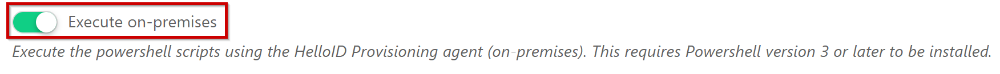

# HelloID-Conn-Prov-Source-ADP-Workforce

## This is a work in progress

The 'HelloID-Conn-Prov-Source-ADP-Workforce' connector needs to be executed 'on-premises'. Make sure you have at least 'Windows PowerShell 5.1' installed on the server where the 'HelloID agent and provisioing agent' are running, and that the 'Execute on-premises' switch is toggled.

Note that the 'HelloID-Conn-Prov-Source-ADP-Workforce' only supports an ADP Workforce enviroment implemented according to standards as specified for the European market. <https://github.com/marketplace-esi/postman-samples>

### Todo

- [X] Add _departments.ps1_
- [ ] Add pagination for the _workerDemographics_ endpoint
- [X] Add logic to obtain an AccessToken inluding a *.pfx certificate

## Table of contents

 - Introduction
 - Prerequisites
 - Getting started
    - Certificate
    - API scoping
    - API discovery
    - Paging
- PowerShell functions
- Setup the PowerShell connector

## Introduction

ADP Workforce is a cloud based HR management platform and provides a set of REST API's that allow you to programmatically interact with it's data. The HelloID source connector uses the API's in the table below.

___The ADP Workforce source connector can only be used in conjunction with the HelloID on premises agent___

---

### API's being used by the HelloID connector

| _API_ | _Description_|
| --- | ----------- |
| _WorkerDemographics_ | _Contains the employees personal and contract data_ |
| _OrganizationDepartments_ | _Contains data about the organisation structure_ |

---

## Prerequisites

- Windows PowerShell 5.1 installed on the server where the 'HelloID agent and provisioing agent' are running.

- The public key *.pfx certificate belonging to the X.509 certificate that's used to activate the required API's.

- The 'Execute on-premises' switch on the 'System' tab is toggled.



## Getting started

### X.509 certificate / public key

To get access to the ADP Workforce API's, a x.509 certificate is needed. This certificate has to be created by the customer.

The public key belonging to the certificate, must be send ADP. ADP will then generate a ClientID and ClientSecret and will activate the required API's.

There are a few options for creating certificates. One of them being the 'OpenSSL' utility. Available on Linux/Windows. https://www.openssl.org/

### X.509 certificate / Private key

The private key (*.pfx) belonging to the X.590 certificate must be used in order obtain an accesstoken.

### AccessToken

In order to retrieve data from the ADP Workforce API's, an AccessToken has to be obtained. The AccessToken is used for all consecutive calls to ADP Workforce. To obtain an AccessToken, we will need the ___ClientID___, ___ClientSecret___ and the private key (*.pfx) certificate.

### API Scope

To obtain the AccessToken you will need to provide an 'API Scope' within the HTTP headers. The scope typically is the API you need access to. For instance, _worker-demographics_. Based on the provided scope, an AccessToken will be generated that will allow access to the specified scope only. In order to obtain an AccessToken for all API's, the scope must be set to: '_api'_.


```powershell
$ClientID = '__YourClientID__'
$ClientSecret = '__YourClientSecret__'
$Certificate = '__YourPfxCertificate__'

$authorization = "$($ClientID):$($ClientSecret)"
$base64String = [System.Convert]::ToBase64String([System.Text.Encoding]::UTF8.GetBytes($authorization))

$headers = @{
    "Cache-Control" = "no-cache"
    "Authorization" = "Basic $base64String"
    "Content-Type" = "application/json"
    "grant_type" = "client_credentials&scope=api"
}
Invoke-RestMethod @splatRestMethodParameters -UserAgent Uri 'https://accounts.dex.adp.com/auth/oauth/v2/token' -Method Post -Headers $headers -Certificate $Certificate

```

The response is a json containing the AccessToken.

```json
{
    "access_token": "",
    "token_type": "Bearer",
    "expires_in": "3600"
}
```

To obtain a token through Postman:

1. Add the *.pfx certificate to ___Settings -> Certificates___.
2. Create a new POST request.
3. Click the __Authorization__ tab and add __Basic Authentication__.
4. The UserName and Password need to be filled in with the ___ClientID___ and ___ClientSecret___.
5. Click the ___Headers___ tab and add a new key/value pair with the key set to: ___grant_type___ and the value to: ___client_credentials&scope=api___

### API Discovery

ADP Workforce provides an enpoint that will obtain information about which API's are current activated for your environment.To see which API's are currently activated, execute the PowerShell code pasted below:

```powershell
$AccessToken = '__YourAccessToken__'

$headers = New-Object "System.Collections.Generic.Dictionary[[String],[String]]"
$headers.Add("Authorization", "$AccessToken")
Invoke-RestMethod 'https://api.dex.adp.com/help/v1/apis' -Method 'GET' -Headers $headers
```

### Paging

Paging is only supported by ADP on the 'worker-demograpics' endpoint. Paging is not yet implemented in the connector.

## PowerShell functions

All PowerShell functions have commentBased help. Both in the sourcecode and within the Github repository. <https://github.com/Tools4everBV/HelloID-Conn-Prov-Source-ADP-Workforce/tree/main/docs/en-US>

### Sample data

If you want to customize the connector according to your own needs, you can use the demo data from ADP. <https://github.com/marketplace-esi/postman-samples/blob/master/workforce/hr/workers-v2-demographics/success/workers-v2-demographics-al-workers-http-200-response.json>

The connector configuration supports a person import from a JSON file.

### Usage in VSCode

If you need to test your code in VSCode, make sure to create a _'$connectionSettings'_ object containing the following fields:

```powershell
$connectionSettings = @{
    BaseUrl = ''
    ClientID = ''
    ClientSecret = ''
    Certificate = ''
    ProxyServer = ''
    JsonFile = ''
    ImportFile = $true
}
```

To execute to code, use the following command:

```powershell
Get-ADPWorkers -Configuration $connectionSettings
```

## Setup the PowerShell connector

1. Add a new 'Source System' to HelloID and make sure to import all the neccasary files.

2. Fill in the required fields on the 'Configuration' tab.

---
